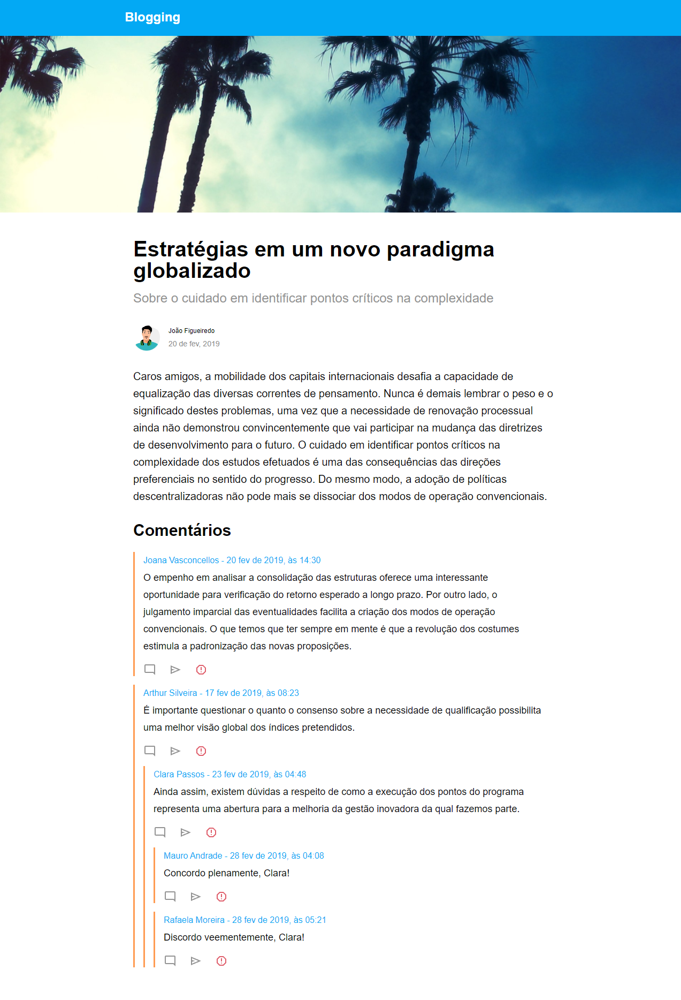

# React Blogging

**Blogging** é uma aplicação de blog desenvolvida com [React](https://reactjs.org/), [Vite](https://vitejs.dev/) e [TypeScript](https://www.typescriptlang.org/). A plataforma permite que os usuários visualizem posts, interajam através de comentários e acessem informações detalhadas sobre outros usuários.

## 🚀 Funcionalidades

- **Visualização de Posts**: Os usuários podem visualizar posts que incluem título, subtítulo, data de publicação, informações sobre o autor e conteúdo completo.
- **Comentários**: Os posts suportam comentários, permitindo que os usuários respondam aos posts e interajam entre si. Comentários podem ser respondidos, criando uma discussão encadeada.
- **Detalhes do Usuário**: Ao clicar no nome de um usuário que comentou, um modal é exibido com informações detalhadas sobre o usuário, como foto, data de filiação, amigos em comum e detalhes de seus posts.

<div style="width:100%; margin-top: 16px; display: flex; align-items:start; justify-content:center">
  
  
</div>

## 💻 Tecnologias Utilizadas

- **React**
- **Vite**
- **TypeScript**
- **HTML**
- **CSS**
- **Jest**

## 📋 Executando o Projeto

Certifique-se de ter o **Node.js** instalado.

1. Clone o repositório: 
   ```sh
   git clone https://github.com/Marianarosadev/blogging.git
   
2. Instale as dependências: 
   ```sh
   npm install

3. Inicie o servidor de desenvolvimento: 
   ```sh
   npm run dev

 Após iniciar o servidor, será possível visualizar a tela de posts e os comentários.

## ⚙️ Executando os testes

Para executar os testes, utilize o comando:

  ```sh
  npm test
